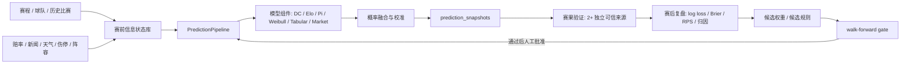

# WC26 Predict

> 2026 世界杯概率预测研究系统。目标只有一个：在可审计、可复现、无数据泄漏的前提下，把预测做得更准。

<p align="center">
  
  
  
  
  
  
</p>

## 当前结论

WC26 Predict 现在处在 **Phase 1C：PredictionPipeline 同源评估样本阶段**，不是“盲目堆模型”的阶段。

已经完成的 V3.5.4 重点：

- 赛果验证改为独立可信来源共识，`user_provided` 只能做人工备注，不能参与自动学习共识。
- 预测快照字段标准化，新增 `match_id` 契约和保守 match resolver。
- 无真实 `match_id` 的预测不允许进入复盘和学习链路。
- 新增 `closed_loop_resolution_ledger`，把旧数据分成 `resolved`、`ambiguous`、`unresolvable_legacy`。
- active 闭环追溯缺口清零；旧快照、旧赔率和旧学习日志被隔离，不再混入学习。
- `postmatch_eval` 已修复到 `48/48` 可追溯。
- 新增 proper scoring 指标：log loss、Brier、RPS。
- walk-forward 回测升级为 champion gate，可比较 DC、Elo、Pi、Weibull、tabular、market、current fusion、uniform baseline。
- 新增 `--enforce-gate`；当前 champion 不合格时返回非零，阻止发布。
- 新增 paired evaluation example，只在同一场、同一预测时点、同一条样本内比较候选与基线。
- 新增 `--enforce-paired-gate`；默认 paired champion 为 `snapshot_adjusted`，默认 paired baselines 为 uniform、DC、Elo、Pi、tabular、market、Weibull。
- `PredictionResult.to_dict()` 已输出统一 `evaluation_sample`，新预测会同时写入 `prediction_snapshots.pipeline_params` 和 `prediction_runs.input_feature_snapshot`。
- walk-forward 回测优先读取 `evaluation_sample`，旧数据没有该字段时继续使用 legacy fallback。
- 新增 `backfill_evaluation_samples.py`，默认 dry-run，只用同一行已有数据回填评估样本。
- `market_only`、`weibull_only` 等样本不足 baseline 会输出 `insufficient_samples`，不会被伪造为通过或失败。
- 非配对 leaderboard 已明确标记为 exploratory，不能再被当作模型优劣结论。
- 每次回测生成 JSON + Markdown 报告到 ignored `backend/reports/`。
- 新增闭环完整性审计脚本，能暴露 prediction snapshot、pre-match snapshot、赔率、学习日志的追溯缺口。
- WC26 小组赛 72 场赛程已绑定到内部 team id；淘汰赛仍需在晋级结果确定后动态绑定。
- 完成一次仓库大扫除：删除可再生成缓存、依赖目录、构建产物和重复旧库，非核心素材归档到 `_archive/` 并从 Git 跟踪中排除。

还不能过度声称的部分：

- 系统还不是完整自动闭环。
- 系统还不能称为可信自进化，只能说“可控自进化基础已开始搭建”。
- 当前不应该直接上线新权重；V3.5.4 只统一评估样本，不改变模型权重，也不宣称更准。
- `snapshot_adjusted` 在配对样本上整体优于 `uniform_baseline`，但存在关键分组退化，并且没有超过 `dc_only`。
- 本地审计显示旧快照和旧赔率已隔离，但真实 xG、市场基准覆盖、阵容伤停数据仍不足。

## 系统目标

本项目不是博彩产品，也不提供投注建议。它是一个面向足球预测研究、赛前信息状态管理、模型回测和赛后复盘的工程系统。

核心问题只有四个：

1. 赛前某个时间点，系统真实知道什么？
2. 在只使用当时已知信息的前提下，模型给出了什么概率？
3. 赛后结果出来后，预测错在哪里？
4. 候选改进能否在 walk-forward 回测中稳定降低 log loss / Brier / RPS？

## 架构概览



## 代码结构

```text
apps/web/                    React + Vite 前端
backend/app/                 FastAPI 后端与核心服务
backend/app/services/        预测、快照、学习、验证、评估服务
backend/scripts/             审计、回填、回测、运维脚本
backend/tests/               后端测试
backend/dashboard/           Streamlit 本地研究工作台
docs/                        架构、合规、状态文档
packages/shared/             前端共享类型与工具
scripts/                     根目录运维脚本
```

## 快速开始

> V3.5 清理后不提交本地依赖目录。首次运行请重新安装依赖。

```powershell
git clone https://github.com/AndyDu0921/wc26-predict.git
cd wc26-predict

# Backend
cd backend
python -m venv .venv
.\.venv\Scripts\Activate.ps1
pip install -r requirements.txt

# Frontend
cd ..
npm ci
```

本地环境变量：

```powershell
Copy-Item .env.example .env
```

重要安全要求：

- `ADMIN_TOKEN` 不能使用默认值 `change-me`。
- `.env`、`.env.local`、`backend/.env` 不应提交。
- API key 泄露后应立即轮换。

## 常用命令

后端测试：

```powershell
cd backend
python -m pytest tests/ -q
```

前端构建：

```powershell
npm run build
```

数据新鲜度审计：

```powershell
cd backend
python scripts/audit_data_freshness.py
```

闭环完整性审计：

```powershell
cd backend
python scripts/audit_closed_loop_integrity.py
```

match_id 回填预览与执行：

```powershell
cd backend
python scripts/backfill_match_ids.py
python scripts/backfill_match_ids.py --apply
```

WC26 小组赛槽位绑定：

```powershell
cd backend
python scripts/bind_wc26_group_slots.py
python scripts/bind_wc26_group_slots.py --apply
```

walk-forward 回测：

```powershell
cd backend
python scripts/walk_forward_backtest.py --min-sample 5
python scripts/walk_forward_backtest.py --min-sample 5 --enforce-gate
python scripts/walk_forward_backtest.py --min-sample 5 --enforce-paired-gate
```

`--enforce-gate` 和 `--enforce-paired-gate` 当前都预期失败；这是正确行为，说明当前 champion / paired champion 还不能发布。

evaluation sample 回填预览：

```powershell
cd backend
python scripts/backfill_evaluation_samples.py
```

本地 Dashboard：

```powershell
powershell -File scripts/start_dashboard.ps1
```

## 当前评估标准

V3.5 之后，任何“更准”的结论必须满足这些门槛：

- 使用 walk-forward，而不是随机切分。
- 按真实时间模拟 `T-24h`、`T-6h`、`T-90m`。
- 主指标固定为 log loss、Brier、RPS。
- accuracy 只作为辅助指标。
- 每个版本保留输入 hash、数据时间戳、模型版本、权重版本、校准版本。
- 新模型至少在两个 proper scoring 指标上超过 champion，并且关键分组不明显退化。
- 配对比较必须优先于非配对 leaderboard；只有同一 evaluation example 内同时存在 candidate 和 baseline 时才允许比较。

## 数据优先级

下一阶段优先补齐的是数据链，而不是新模型数量。

高优先级数据：

- 真实 xG、射门、射正、红黄牌、定位球。
- 首发阵容、出场分钟、伤停、停赛、球员可用性。
- 休息天数、旅行距离、场地、天气、海拔、时区。
- FIFA ranking、Elo、赛事重要性、杯赛/友谊赛/淘汰赛标签。
- 市场赔率快照，先作为 shadow benchmark，完成泄漏保护后再考虑进入融合。

所有数据必须带：

- `source`
- `source_time`
- `available_at`
- `match_id`
- team id 映射

## 迭代路线

### Phase 0B：数据链路修复

- 回填历史 `prediction_snapshots`、`pre_match_snapshots`、`prediction_runs` 的 `match_id`。
- 建立更稳健的 match resolver。
- 赔率、新闻、伤停、阵容统一绑定 `match_id` 与 `available_at`。
- 验收：任意一条预测都能从 `match_id` 追溯到赛前快照、预测运行、赛果验证、学习日志。

### Phase 1：walk-forward 回测门

- 模型分开评估：DC-only、Elo-only、Pi-only、Weibull、tabular、market-only、current fusion。
- 按 horizon 和比赛类型分组。
- 已新增 paired gate，避免把不同表、不同样本集的 leaderboard 当成模型优劣结论。
- 验收：能明确回答 champion 是否优于 uniform / DC-only / Elo-only / market baseline。

### Phase 1C：统一评估样本输出

- 收敛 CLI / API / 脚本分叉到 `PredictionPipeline`。
- 让 `current_fusion`、组件模型、市场基准在同一条 prediction artifact 中输出。
- 为 stacking / meta-learner 准备 walk-forward out-of-fold 训练样本。
- 已完成：新预测输出 `evaluation_sample`，回测优先读取同源样本，旧数据可安全 dry-run 回填。

### Phase 2：高价值赛前数据

- 接入真实 xG、阵容、伤停、赔率、天气、休息与旅途。
- 所有训练和预测按 `as_of_time` 读取数据。
- 验收：训练不会偷看赛后信息。

### Phase 3：模型升级

- 先修 tabular 特征泄漏和训练/推理分布不一致。
- 重建校准器，废弃小样本不可信 artifact。
- 增加 time-decay Dixon-Coles、dynamic bivariate Poisson、Bayesian hierarchical national-team model。
- stacking/meta-learner 只能使用 walk-forward out-of-fold 预测训练。

### Phase 4：可控自进化

- 每场赛后自动生成误差归因。
- 学习系统只生成候选权重/候选规则，不直接覆盖线上模型。
- 候选必须通过滚动回测、分组回测、泄漏检测和人工批准。

## 合规声明

- 本项目用于研究、教育和内容分析。
- 不提供投注建议。
- 不承诺预测准确率。
- 不展示诱导性博彩结论。
- 公开输出应优先解释不确定性、数据来源和模型局限。

## 版本

当前主版本：**V3.5.4 Pipeline Eval Samples**

- Version: `3.5.4-pipeline-eval-samples`
- Tag: `v3.5.4-pipeline-eval-samples`
- Branch target: `master`
- 状态：测试版，重点是闭环可信度和数据链路，不是最终预测精度版本。

## 贡献

欢迎关注这些方向：

- 无泄漏历史数据集构建。
- 国家队球员层数据与阵容强度建模。
- walk-forward benchmark 与校准评估。
- 赛后误差归因与自动学习报告。
- 非博彩化公开输出策略。

---

Made by Andy. Built for transparent football prediction research.
