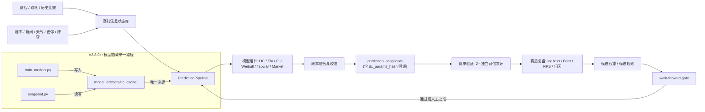

# WC26 Predict

> 2026 世界杯概率预测研究系统。目标只有一个：在可审计、可复现、无数据泄漏的前提下，把预测做得更准。

<p align="center">
  
  
  
  
  
  
</p>

## 当前结论

WC26 Predict 现在处在 **Phase 2B：自进化 + 赛后复盘学习** 阶段，已进入 WC 2026 小组赛实时预测。

**V4.2.2-beta（2026-06-25）当前状态：**

- **组件表现 (13场累计)**：Market 11/13 (85%), DC 10/13 (77%), Pi 9/13 (69%), Elo 9/13 (69%), Enhancer 3/13 (23%)
- **权重版本**：`WORLD_CUP_V4.2.2` — dc=0.68 enhancer_blend=0.32 elo=0.12 pi=0.14 weibull=0.10 market_max=0.30
- **54/104 场小组赛已完成**，50 场待进行
- **预测流水线**：DC → Enhancer → Weibull → Elo → Pi → Market（6 级顺序融合）+ 战意因子 + 平局下限 12% + 分歧悖论修复
- **赛后复盘**：13 场完整复盘报告在 `reports/postmatch/`，含组件级 Brier/LogLoss/方向正确率
- **自进化**：Pi 权重从 0.12 → 0.14（本轮 5/6 方向正确，最佳非市场组件）
- **已知问题**：Enhancer 系统性偏向下盘（累计 23% 方向正确），分歧 guard (dc=0.68) 有效压制其影响
- **关键发现**：南非 1-0 韩国是本届首次共识失败（6/6 组件全部错误），market 赔率是最可靠信号（85%）

**V4.2.1-beta 完成的修复 (8 项中 5 项已合并)：**

- ✅ B1: prediction_pipeline.py 同步 V4.2 特性（战意因子 + 平局下限 + 分歧悖论）
- ✅ B2: MotivationEvent 持久化代码就绪（下一轮 WC 比赛自动激活）
- ✅ B5: auto_backfill 概率存储兼容 V3.8 格式
- ✅ B6: DEFENSIVE/DEFENSIVE_ASYMMETRIC 分类全部可达
- ✅ B7: ECE 计算修复（自身减自身 → 实际 vs 预测比较）
- 🔵 B3/B4/B8 按计划延至 V4.3.0

## 系统目标

本项目不是赛事商业导流产品，也不提供赛事情境决策建议。它是一个面向足球预测研究、赛前信息状态管理、模型回测和赛后复盘的工程系统。

核心问题只有四个：

1. 赛前某个时间点，系统真实知道什么？
2. 在只使用当时已知信息的前提下，模型给出了什么概率？
3. 赛后结果出来后，预测错在哪里？
4. 候选改进能否在 walk-forward 回测中稳定降低 log loss / Brier / RPS？

## 架构概览



## 代码结构

```text
backend/app/                 FastAPI 后端与核心服务
backend/app/services/        预测、快照、学习、验证、评估服务
backend/app/services/prediction_core.py  模型加载（disk cache 唯一路径）
backend/app/services/weights.py          权重配置（DB auto_optimized）
backend/model_artifacts/dc_cache/        模型磁盘缓存（DC + Enhancer）
backend/artifacts/ratings/              Elo / Pi Rating JSON 文件
backend/artifacts/dataframes/           训练数据 pickle
backend/scripts/             审计、回填、回测、复盘、运维脚本
backend/tests/               后端测试
backend/dashboard/           Streamlit 本地研究工作台
backend/data/                SQLite 数据库
reports/postmatch/           赛后复盘报告
docs/                        架构、合规、状态文档、CHANGELOG
```

## 快速开始

> V3.5 清理后不提交本地依赖目录。首次运行请重新安装依赖。

```powershell
git clone https://github.com/AndyDu0921/wc26-predict.git
cd wc26-predict

# Backend
cd backend
python -m venv .venv
.\.venv\Scripts\Activate.ps1
pip install -r requirements.txt

# Frontend
cd ..
npm ci
```

本地环境变量：

```powershell
Copy-Item .env.example .env
```

重要安全要求：

- `ADMIN_TOKEN` 不能使用默认值 `change-me`。
- `.env`、`.env.local`、`backend/.env` 不应提交。
- API key 泄露后应立即轮换。

## 常用命令

后端测试：

```powershell
cd backend
python -m pytest tests/ -q
```

完整的预测 + 报告工作流：

```powershell
cd backend

# 1. 生成单场完整预测分析报告
python scripts/predict_match_full.py --home "Brazil" --away "Germany" --competition "FIFA World Cup 2026" --stage "Group A - Matchday 1"

# 2. 批量运行赛后复盘 + 自进化
python scripts/run_postmatch_complete.py

# 3. 回填历史赛后数据
python scripts/backfill_postmatch_evals.py --auto

# 4. 自动化赛后验证
python scripts/auto_postmatch.py

# 5. 赛后复盘审核
python scripts/postmatch_review.py
```

WC26 赛程与模拟：

```powershell
cd backend

# 种子数据
python scripts/seed_wc26_schedule.py

# 锦标赛模拟
python scripts/simulate_wc26.py

# 模型训练
python scripts/train_models.py
```

本地 Dashboard：

```powershell
powershell -File scripts/start_dashboard.ps1
```

## 当前评估标准

V3.5 之后，任何“更准”的结论必须满足这些门槛：

- 使用 walk-forward，而不是随机切分。
- 按真实时间模拟 `T-24h`、`T-6h`、`T-90m`。
- 主指标固定为 log loss、Brier、RPS。
- accuracy 只作为辅助指标。
- 每个版本保留输入 hash、数据时间戳、模型版本、权重版本、校准版本。
- 新模型至少在两个 proper scoring 指标上超过 champion，并且关键分组不明显退化。
- 配对比较必须优先于非配对 leaderboard；只有同一 evaluation example 内同时存在 candidate 和 baseline 时才允许比较。

## 数据优先级

下一阶段优先补齐的是数据链，而不是新模型数量。

高优先级数据：

- 真实 xG、射门、射正、红黄牌、定位球。
- 首发阵容、出场分钟、伤停、停赛、球员可用性。
- 休息天数、旅行距离、场地、天气、海拔、时区。
- FIFA ranking、Elo、赛事重要性、杯赛/友谊赛/淘汰赛标签。
- 市场赔率快照，先作为 shadow benchmark，完成泄漏保护后再考虑进入融合。

所有数据必须带：

- `source`
- `source_time`
- `available_at`
- `match_id`
- team id 映射

## 迭代路线

### Phase 0B：数据链路修复

- 回填历史 `prediction_snapshots`、`pre_match_snapshots`、`prediction_runs` 的 `match_id`。
- 建立更稳健的 match resolver。
- 赔率、新闻、伤停、阵容统一绑定 `match_id` 与 `available_at`。
- 验收：任意一条预测都能从 `match_id` 追溯到赛前快照、预测运行、赛果验证、学习日志。

### Phase 1：walk-forward 回测门

- 模型分开评估：DC-only、Elo-only、Pi-only、Weibull、tabular、market-only、current fusion。
- 按 horizon 和比赛类型分组。
- 已新增 paired gate，避免把不同表、不同样本集的 leaderboard 当成模型优劣结论。
- 验收：能明确回答 champion 是否优于 uniform / DC-only / Elo-only / market baseline。

### Phase 1C：统一评估样本输出

- 收敛 CLI / API / 脚本分叉到 `PredictionPipeline`。
- 让 `current_fusion`、组件模型、市场基准在同一条 prediction artifact 中输出。
- 为 stacking / meta-learner 准备 walk-forward out-of-fold 训练样本。
- 已完成：新预测输出 `evaluation_sample`，回测优先读取同源样本，旧数据可安全 dry-run 回填。

### Phase 2：高价值赛前数据

- 已完成 V3.6.0：先建立 `audit_data_provenance.py`，把真实 xG、赔率、阵容、伤停和赛前快照来源缺口显式化。
- 已完成 V3.6.1：新增 `postmatch_team_stats` 与 StatsBomb open-data 回填路径，先补真实赛后统计链路。
- 接入真实 xG、阵容、伤停、赔率、天气、休息与旅途。
- 所有训练和预测按 `as_of_time` 读取数据。
- 验收：训练不会偷看赛后信息。

### Phase 3：模型升级

- 先修 tabular 特征泄漏和训练/推理分布不一致。
- 重建校准器，废弃小样本不可信 artifact。
- 增加 time-decay Dixon-Coles、dynamic bivariate Poisson、Bayesian hierarchical national-team model。
- stacking/meta-learner 只能使用 walk-forward out-of-fold 预测训练。

### Phase 4：可控自进化

- 每场赛后自动生成误差归因。
- 学习系统只生成候选权重/候选规则，不直接覆盖线上模型。
- 候选必须通过滚动回测、分组回测、泄漏检测和人工批准。

## 合规声明

- 本项目用于研究、教育和内容分析。
- 不提供赛事情境决策建议。
- 不承诺预测准确率。
- 不展示诱导性商业导流结论。
- 公开输出应优先解释不确定性、数据来源和模型局限。

## 版本

当前主版本：**V4.2.2-beta**

- Version: `4.2.2-beta`
- Tag: `v4.2.2-beta`
- Branch: `master`
- 状态：Phase 2B — 赛后复盘 + 自进化 + WC 小组赛实战
- 完整 CHANGELOG: [`docs/CHANGELOG_V3.8.0.md`](docs/CHANGELOG_V3.8.0.md)

### 最近版本历史

| 版本 | 日期 | 关键变更 |
|------|------|---------|
| **V4.2.2-beta** | 2026-06-25 | 自进化 Pi 0.12→0.14 + 6场 June25 赛后复盘 |
| **V4.2.1-beta** | 2026-06-25 | 8项 B1-B8 修复: pipeline 同步/战意/平局下限/分歧悖论 |
| **V4.2.0-beta** | 2026-06-24 | 战意因子 + 平局下限 + 分歧悖论修复 |
| **V4.1.6-beta** | 2026-06-24 | 全局版本同步 + 代码库清理 |
| V4.0.5 | 2026-06-20 | 动态 Market Boost + 自适应 DC 权重 |
| V3.8.0 | 2026-06-15 | 模型加载链修复 + 权重门控 + 参数溯源 |

## 贡献

欢迎关注这些方向：

- 无泄漏历史数据集构建。
- 国家队球员层数据与阵容强度建模。
- walk-forward benchmark 与校准评估。
- 赛后误差归因与自动学习报告。
- 公开输出合规策略。

---

Made by Andy. Built for transparent football prediction research.
